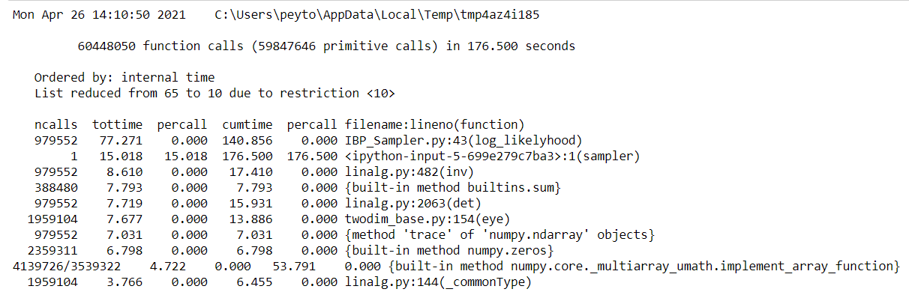
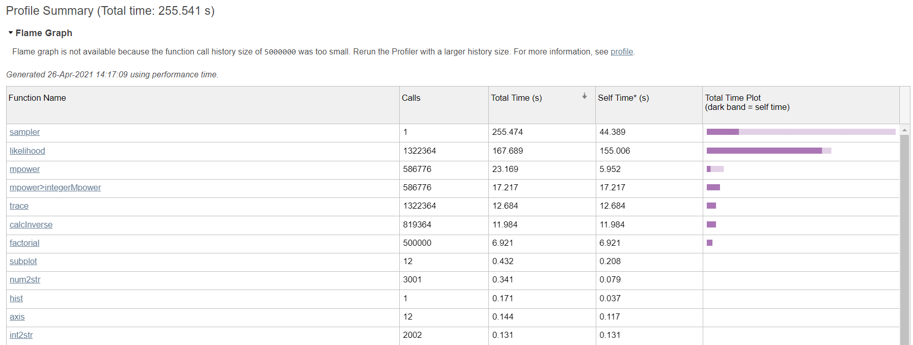

```{r library, message=FALSE, warning=FALSE, echo=FALSE}
library(tidyverse)
library(kableExtra)
```

# Abstract

The dimensionality of representation is a critical question to solve in unsupervised learning when we try to represent objects with multiple latent features. One method to solve this question is to apply a Bayesian latent feature model where the prior is used to represent the number of latent features. The Indian buffet process is an efficient stochastic process that can generate a prior for a model to represent objects with an infinite number of latent features. In this paper, we implement the basic algorithm of a binary latent-feature model where the prior is generated by the Indian buffet process. We explore ways to optimize the algorithm and test the algorithm using simulated data sets and real data sets. We also compare the algorithm with two competing algorithms.

# 1 Introduction

Unsupervised learning techniques have gained attention in academia and the industry due to their application in a variety of fields, such as image and pattern recognition, cancer research, consumer research, etc (Bouguila et al, 2005; ISLR). These techniques can help us identify the properties of objects even in the absence of response variables. The properties of these objects can be better captured if we use multiple latent features to represent the objects (Griffiths & Ghahramani, 2005). As we work with latent features, one question we often need to consider is how many latent features do we need to use to represent the objects (Griffiths & Ghahramani, 2005). The number of latent features can be finite or infinite. If we assume the dimension is infinite, one way to determine the latent structure is to use a Bayesian latent feature model, in which we use a prior distribution to represent the number of latent features needed, and use the likelihood function to analyze how these latent features are associated with the objects in the data set. The Indian buffet process provides an efficient way to generate a prior distribution for a latent feature model over equivalence classes of binary matrices with a finite number of rows but potentially an infinite number of columns. Such a model can be used to represent each object with a large number of latent features.

One of the applications of the Indian buffet process is image processing. For example, Dang and Chainais applied the Indian buffet process as a prior and proposed a Bayesian nonparametric approach called Indian buffet process dictionary learning. The algorithm was applied to image inpainting and compressive sensing (Dang & Chainais, 2017).

In this paper, we implement the algorithm of the Indian buffet process described in the paper titled "Infinite Latent Feature Models and the Indian Buffet Process" by Thomas L. Griffiths and Zoubin Ghahramani. We use the Indian buffet process to generate a prior for a linear-Gaussian binary latent feature model described in the paper, and implemented a Gibbs sampler to find the most frequent latent features. We explore ways to make the algorithm more efficient using computational techniques in Python and test the algorithm using simulated data and real-world data. We also compare the efficiency of our algorithm with two competing algorithms.

# 2 Description of Algorithm

## 2.1 Indian Buffet Process

We can use the Indian buffet process to generate a binary matrix $\textbf{Z}$ that shows which latent features are associated with each of the objects. If $k$th feature is associated with the $i$th object, then we will set $z_{ik} = 1$; otherwise, we will set $z_{ik} = 0$. Suppose we have N objects, then the binary matrix $\textbf{Z}$ would have a dimension of $N \times D$, where D is the number of the features that we would have at the end of the process. 

The Indian buffet process draws an analogy with Indian buffet restaurants in London. The restaurants have a large number of dishes for customers to choose from. Suppose we have N customers entering the restaurant one after another. The first customer takes the first Possison$(\alpha)$ dishes. The dishes that were taken by this customer are "recorded" in the first row of the matrix $\textbf{Z}$ by setting $z_{1k} = 1$ where $k$ represents the location of the dishes taken by this customer. All dishes that are not taken by this customer remain as $0$ in $\textbf{Z}$. Then for each of the customers followed, the $i$th customer considers all the dishes that have been taken by all previous customers based on popularity, and takes each dish with a probability of $\frac{m_k}{i}$ where $m_k$ is the number of customers who have tried the dish. Once this customer has considered all the dishes that have been tried by previous customers, s/he tries Poisson$(\alpha/i)$ dishes that have not been tried by any of the previous customers. All the dishes that are taken by each customer are "recorded" in $\textbf{Z}$ in the same manner.

The probability of getting a matrix $\textbf{Z}$ is as follows:

$$
\begin{aligned}
P(\textbf{Z}) = \frac{\alpha^{K_+}}{\prod_{i=1}^{K+} K_1^{(i)}!} exp\{-\alpha H_N\} \prod_{k=1}^{K+} \frac{(N - m_k)!(m_k - 1)!}{N!}
\end{aligned}
$$

where $K^{+}$ represents the number of dishes that have been tried by at least one customer (i.e. $m_k > 0$), and $K_1^{(i)}$ represents the number of new dishes taken by the $i$th customer.

Once we know the distribution of $\textbf{Z}$, we can define the full condtional for $z_{ik = 1}$ in $\textbf{Z}$ as $P(z_{ik} = 1 \mid \textbf{Z}_{-ik})$. But we only need to condition on the elements in the same column $\textbf{z}_{-i,k}$ since columns are independent. Therefore, we have the full conditional for $z_{ik}$ as follows:

$$
\begin{aligned}
P(z_{ik = 1} \mid \textbf{z}_{-i,k}) = \frac{m_{-i,k}}{N}
\end{aligned}
$$


## 2.2 Applying the Indian buffet process to a linear-Gaussian binary latent feature model

We use the linear-Gaussian binary latent feature model dervied in the paper, where the likelihood function is as follows:

$$
\begin{aligned}
P(\textbf{X} \mid \textbf{Z}, \sigma_X, \sigma_A) = \frac{1}{(2\pi)^{ND/2}\sigma_X^{(N - K)D} \sigma_A^{KD}
\lvert \textbf{Z}^T\textbf{Z} + \frac{\sigma_X^2}{\sigma_A^2}I \rvert ^ {D/2}}
exp\{-\frac{1}{2\sigma_X^2} tr(\textbf{X}^T(\textbf{I} - \textbf{Z}(\textbf{Z}^T \textbf{Z} + \frac{\sigma_X^2}{\sigma_A^2}I)^{-1} \textbf{Z}^T)\textbf{X}) \}
\end{aligned}
$$

To avoid potential underflow/overflow during the computation, we compute the log-likelihood function first and exponentiate it to get the likelihood. The log-likelihood function has the following form:

$$
\begin{aligned}
l(\textbf{X} \mid \textbf{Z}, \sigma_X, \sigma_A) &= -\{ \frac{ND}{2} log(2\pi) + \frac{N - K}{D} log(\sigma_X) +
KD log(\sigma_A) + \frac{D}{2}log(\lvert \textbf{Z}^T\textbf{Z} + \frac{\sigma_X^2}{\sigma_A^2}I \rvert) \} \\
&-\frac{1}{2\sigma_X^2} tr(\textbf{X}^T(\textbf{I} - \textbf{Z}(\textbf{Z}^T \textbf{Z} + \frac{\sigma_X^2}{\sigma_A^2}I)^{-1} \textbf{Z}^T)\textbf{X})
\end{aligned}
$$

With the likelihood function, we can find the full conditional of $z_{ik}$ by multiplying the likelihood function by the prior mentioned earlier:

$$
\begin{aligned}
P(z_{ik} \mid \textbf{X}, \textbf{Z}_{-ik}, \sigma_X, \sigma_A) \propto P(\textbf{X} \mid \textbf{Z}, \sigma_X, \sigma_A) P(z_{ik} \mid \textbf{z}_{-i,k}) 
\end{aligned}
$$

With each iteration, we will be checking to see if any new columns ($K_{new}$) may be added to the Z matrix. The $K_{new}$ distribution looks as so. 

$$
\begin{aligned}
&Prior: P(K_{new} \mid \alpha) \propto Poisson(\frac{\alpha}{N}) \\
&Posterior: P(K_{new} \mid \textbf{X},\textbf{Z},\sigma_X, \sigma_A, \alpha) \propto P(K_{new} \mid \alpha) P(\textbf{X} \mid \textbf{Z*}, \sigma_X, \sigma_A) \\
&\textbf{Z*} = Z\ with\ K_{new}\ columns\ appended
\end{aligned}
$$

We will also be considering the distributions of $\sigma_X,\sigma_A,$ and $\alpha$

For $\sigma_X,\sigma_A$ we will be utilzing the Metropolis Hastings Algorithm by comparing values of $P(\textbf{X} \mid \textbf{Z}, \sigma_X, \sigma_A)$ under our current values of $\sigma_X,\sigma_A$ against new values of $\sigma_X,\sigma_A$ to see if they should be updated.  

The Distribution of $\alpha$ is as so:

$$
\begin{aligned}
&Prior: P(\alpha) \propto Gamma(a,b) \\
&Posterior: P(\alpha \mid \textbf{Z}) \propto Gamma(a + K,b + H_{n}) \\
&a\ and\ b\ are\ hyperparamaters
\end{aligned}
$$

## 2.3 Gibbs Sampler Steps

1. Set X, number of iterations, number of potential new columns per iteration, inital $\alpha, \alpha$ priors, $\epsilon$, intial $\sigma_{X}, \sigma_{A}$  
2. Initialize Z with Indian buffett process  
3. For each iteration until max iterations:
a) For each $Z_{ik}$, sample to see if it is 0 or 1 using the fully conditional probability distribution laid out above   
b) Sample to see if more columns should be added (increase k) or potentially be removed using the fully conditional probability distribution laid out above   
c) Use MH and update $\sigma_X$ as neccesary   
d) Use MH and update $\sigma_A$ as neccesary  
e) Sample $\alpha$ from its posterior gamma distribution

# 3 Optimization for Performance

In this section, we explore a few optimization methods to make the sampler more efficient. The test results can be found in section 3.4. The testing detail can be founded in the `Optimization.ipynb` in the GitHub repository.


## 3.1 Profile

We adopt the decorator from a post on Medium written by Farhad Malik (Malik 2020) to profile our original python code. 

We generated an initial profile in Figure 1. From the profile above, we can see that most of the runtime was spent on the `log_likelyhood` function. Therefore, we concentrated our energy to explore how to optimize the performance of our `log_likelyhood` function.




## 3.2 Optimization of Matrix Calculations

First, we explored ways to optimize the `log_likelyhood` function by calculating the determinant and inverse of matrix $\textbf{M}$ differently.

We define a `sampler_test` function that allows us to use different log likelyhood functions as input. We test each method using the same inputs with `niter = 100`.

### 3.2.1 Replacing `inv` with `solve`

In this approach, we consider replacing the calculation of inverse matrix with linear solve. Our intuition is linear solve may have a smaller complexity than calculating the inverse of matrix $\textbf{M}$. We have to calculate $\textbf{Z} \textbf{M}^{-1} \textbf{Z}^T$. So instead of calculating `Z @ np.linalg.inv(M) @ Z.T`, we tried `Z @ np.linalg.solve(M, Z.T)`. 

However, we found the performance is comparable. Using `np.linalg.solve` may not have a noticeable improvement for the function.

### 3.2.2 Singular Value Decomposition

We also explored a way of computing the determinant and the inverse matrix using singular value decomposition. Since $\textbf{Z}^T \textbf{Z} + \frac{\sigma_X^2}{\sigma_A^2}\textbf{I}$ is a nonsingular matrix, we can calculate the determinant by calculating the products of the singular values $s$. Once we have $U$ and $V^T$ from the singular value decomposition, we can also calculate the inverse of matrix $\textbf{M}$ as $V D^{-1} U^T$ where $D^{-1}$ is a diagonal matrix with diagonal elements $1/s$.

But the performance is comparable to the original likelyhood function. It may be a bit slower than the original function. This may be due to the computational time required by finding the singular value decomposition.

### 3.2.3 Using functools

We also tried to use the `reduce` function from `functools` to see if we can improve the performance. Once again, we did not find any noticeable improvement in speed. Therefore, we decide to explore optimization methods using cython and numba with the original `log_likelyhood` function. 


## 3.3 Cython and Numba

Next, we tried to optimize the `log_likelyhood` function using cython. We compared the speed of doing matrix multiplication using the `@` operator in numpy with a matrix multiplication function written in cython. 

### 3.3.1 Comparing the performance of matrix multiplication

First, we compared the performance for matrix multiplication between the `@` operator in numpy and the `matrix_multiply` function we wrote in cython.

We randomly generated a matrix $A_1$ with size $1000 \times 36$ and a matrix with $A_2$ with size $36 \times 1000$ to compare the performance of matrix multiplication. We found that our `matrix_multiply` function written in cython is much slower than the `@` operator in numpy. Since matrix multiplications take a considerable amount of time in the `log_likelyhood` function, we decided not to use `matrix_multiply` function but wrote a cythonized `log_likelyhood` function using the `matmul` function in numpy. 

### 3.3.2 Cythonize the `log_likelyhood` function

As we can see from the comparison above, cythonizing the liklyhood function does not outperfrom the original likelyhood function. One of the reasons can be our cython code still depends heavily on functions in the numpy package to compute the determinant and the inverse function. Using numpy functions in cython may create unnecessary overhead. Due to the complex data structures in cython, we chose to stick with the original `likelyhood` function for now.

### 3.3.3 Numba

We also tried to use numba for matrix multiplication. But we found that the speed of matrix multiplication is much slower than using `@` operator in numpy. We can conclude that numba is not an optimal choice for our algorithm.


## 3.4 Conclusion on Optimization

The table below shows a brief summary of the average speed of different methods when we tested them with `niter = 100`.

```{r,echo=FALSE}
df <- data.frame(Original = 32.9,
                 Linear_solve = 34.3,
                 SVD = 39.2,
                 Reduce = 33.2,
                 Cython = 36.5)
row.names(df) <- c("Speed (in seconds)")
kable(df)
```

Based on the results, we did not find any method that provides a significant improvment for the speed of the algorithm. Therefore, we decided to use the original function written with numpy as final algorithm.


# 4 Applications to Simulated Data Sets

For this simulation, we followed the procedures laid out in Ilker Yildrim’s paper. To begin, we created four basis images. 

<p>

</p>

As we can see, each basis image has a different section and shape of the 6 by 6 grid. We used these basis images to construct our X with some noise added in ($\sigma_X$ = .5). For this simulation, we ran it with 2 different seeds to see if/how the results would change as the code is quite dependent on random number generation. Both simulations ran for 1000 runs and had the same initial parameter settings.

**Intital Paramater Settings**  
-$\alpha$ = 1  
-$\epsilon$ = .05  
-$\alpha_a$ prior = 1   
-$\alpha_b$ prior = 1  
-$\sigma_X$ = 1   
-$\sigma_A$ = 1   
-max new ks (per iteration) = 4 

Upon finishing the Gibbs sample, we found the Expected feature matrix which is calculated as so  
E [A | Z, X] = ($Z^TZ + \sigma_x^2/\sigma_a^2*I)^{-1}Z^TX$

**Simulation 1**  
<p>
  
</p>

<p>
  
</p>


**Simulation 2**  
<p>
  
</p>

<p>

</p>

Both simulations returned very similar latent features not only to each other but also the original basis images. One difference is that the latent features seemed to have combined two of the original basis images together but we are still getting the same features as what was originally coded in. The first simulation had a greater fluctuation in the value of k as it constantly moved between 3 and 6 and finally settled at 3 whereas the second simulation seemed to oscillate mainly between 3 and 4 with less frequent movement. Based on the latent images we have shown at the end, it is reasonable to assume that values with different ks are returning the same features just in a different form. In both, the $\sigma_X$ also converged around the true value of .5. 

# 5 Applications to Real Data Sets

In addition to the simulation, we also ran our algorithm against a real world dataset to gain deeper insights into the application of IBP. For this real world Example, we choose 6 images of a die with each image corresponding to a number on a die. 

<p>
  
</p>

Once again, we ran two simulations with different seeds to help control for some of the randomness that occurs with this process. This time each run was for 500 iterations. 

**Intital Paramater Settings**  
-$\alpha$ = 1  
-$\epsilon$ = .05  
-$\alpha_a$ prior = 1   
-$\alpha_b$ prior = 1  
-$\sigma_X$ = .4   
-$\sigma_A$ = .5   
-max new ks (per iteration) = 3 

**Sample 1**  
<p>
  
</p>

<p>
  
</p>


**Sample 2**  
<p>
  
</p>

<p>

</p>

The results from the 2 runs appear quite similar to each other with some minor differences. In the first run, 12 latent features are discovered instead of 11 like in the 2nd run. The first simulation most commonly returns a pattern with 7 dots each lined up as to contain all possible numbers while the second simulation most commonly picks up a pattern like that in the number 5. However, both still do a good job at capturing the patterns of the dice which is highly encouraging. There is much less movement in K compared to the simulation example with the 2nd run not changing from its original value of 11. Both $\sigma_X$ also are converging towards the true value of .25. 


# 6 Comparative Analysis

## 6.1 Comparing Indian Buffet Process and Chinese Restaurant Process

The Chinese Restaurant Process (CRP) is another Bayesian method used to discover latent features and is often compared to the Indian Buffet Process. In the CRP, there are infinite customers and infinite tables. The first customer sits down at the first table. The next customer can either sit down at the same table or choose an unoccupied table. This then repeats for all of the customers where the probability of sitting at an already occupied table is proportional to the number of people sitting at the table and the probability of sitting at an unoccupied table is $\alpha$.  

While both involve finding latent features they do have some pretty stark differences. The Chinese Restaurant Process can be thought of as a traditional clustering algorithm where objects (customers) are put into a class (table). The Indian Buffet process, however, allocates features where each object (customer) takes on certain features (dishes). This allows for more flexibility and therefore may be more favorable of the two especially when the features get more complicated and it's harder to partition the data into reasonable sections.

## 6.2 Comparing with an MATLAB Code Online

In section 4, we used the example images used in Ilker Yildirim's paper as my simulation data set to test the accuracy of our algorithm. In this section, we compare the speed of our algorithm with the written in MATLAB in this paper (Yildirim 2012). We continue to use the same example images and ran the sampler with the input `niter=1000`. We profiled the the MATLAB code and found the total runtime to be about 255 seconds (Figure X).  This appears to be slower than our algorithm in Python. As shown in section 4, our results are consistent with the results produced by Yildirim.  



# 7 Conclusion

The Indian Buffet Process is a fairly popular tool used in Bayesian Unsupervised Learning. Through this paper, we have succesfully implemented the algorithm mentioned in the paper by Griffiths and Ghahraman and tested it in a simulated setting and a real world example. In addition, we did tests to discover that our algorithm was the most efficent and even compared our process to other popular techniques like the Chinese Restaurant Proces and other implementations of the Indian Buffet Process done in Matlab. 

While the Indian Buffet Process is a powerful tool that can be used to discover latent variables, it does have some drawbacks. As much of the sampling is using random number generators like "np.random.random()" and "np.random.poisson" it can be dependent on what random numbers are being generated. Although our results were fairly consistent, more testing may need to be considered. In addition, the Gibbs Samplers require inputs of priors that may be difficult to have an initial inclination of their value. 

For more information about the code, diagrams, or package installation regarding the material in this paper, please visit https://github.com/peytonychen7/STA-663-Final-Project. 


# 8 References

Bouguila, Nizar, and Djemel Ziou. “Using Unsupervised Learning of a Finite Dirichlet Mixture Model to Improve Pattern Recognition Applications.” Pattern Recognition Letters, vol. 26, no. 12, 2005, pp. 1916–1925., doi:10.1016/j.patrec.2005.03.016. 

Dang, Hong-Phuong, and Pierre Chainais. “Indian Buffet Process Dictionary Learning: Algorithms and Applications to Image Processing.” International Journal of Approximate Reasoning, vol. 83, 2017, pp. 1–20., doi:10.1016/j.ijar.2016.12.010. 

Griffiths, Thomas L., and Zoubin Ghahramani. “Infinite Latent Feature Models and the Indian Buffet Process.” 2005. 

An Introduction to Statistical Learning (ISLR): with Applications in R, by Gareth James et al., Springer, 2013, pp. 373–374. 

Malik, Farhad. “Advanced Python: Learn How To Profile Python Code.” Medium, FinTechExplained, 20 July 2020, medium.com/fintechexplained/advanced-python-learn-how-to-profile-python-code-1068055460f9. 

Yildirim, Ilker. "Bayesian Statistics: Indian Buffet Process." August 2012, https://www2.bcs.rochester.edu/sites/jacobslab/cheat_sheet/IndianBuffetProcess.pdf