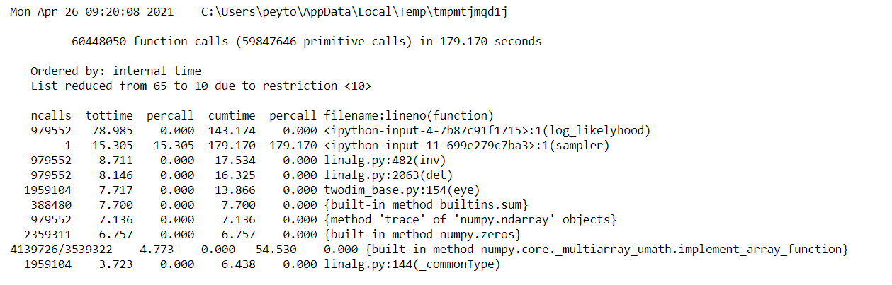

```{r library, message=FALSE, warning=FALSE, echo=FALSE}
library(tidyverse)
library(kableExtra)
```

# Abstract

# 1 Introduction

# 2 Description of Algorithm

## 2.1 Indian Buffet Process

We can use the Indian buffet process to generate a binary matrix $\textbf{Z}$ that shows which latent features are associated with each of the objects. If $k$th feature is associated with the $i$th object, then we will set $z_{ik} = 1$; otherwise, we will set $z_{ik} = 0$. Suppose we have N objects, then the binary matrix $\textbf{Z}$ would have a dimension of $N \times D$, where D is the number of the features that we would have at the end of the process. 

The Indian buffet process draws an analogy with Indian buffet restaurants in London. The restaurants have a large number of dishes for customers to choose from. Suppose we have N customers entering the restaurant one after another. The first customer takes the first Possison$(\alpha)$ dishes. The dishes that were taken by this customer are "recorded" in the first row of the matrix $\textbf{Z}$ by setting $z_{1k} = 1$ where $k$ represents the location of the dishes taken by this customer. All dishes that are not taken by this customer remain as $0$ in $\textbf{Z}$. Then for each of the customers followed, the $i$th customer considers all the dishes that have been taken by all previous customers based on popularity, and takes each dish with a probability of $\frac{m_k}{i}$ where $m_k$ is the number of customers who have tried the dish. Once this customer has considered all the dishes that have been tried by previous customers, s/he tries Poisson$(\alpha/i)$ dishes that have not been tried by any of the previous customers. All the dishes that are taken by each customer are "recorded" in $\textbf{Z}$ in the same manner.

The probability of getting a matrix $\textbf{Z}$ is as follows:

$$
\begin{aligned}
P(\textbf{Z}) = \frac{\alpha^{K_+}}{\prod_{i=1}^{K+} K_1^{(i)}!} exp\{-\alpha H_N\} \prod_{k=1}^{K+} \frac{(N - m_k)!(m_k - 1)!}{N!}
\end{aligned}
$$

where $K^{+}$ represents the number of dishes that have been tried by at least one customer (i.e. $m_k > 0$), and $K_1^{(i)}$ represents the number of new dishes taken by the $i$th customer.

Once we know the distribution of $\textbf{Z}$, we can define the full condtional for $z_{ik = 1}$ in $\textbf{Z}$ as $P(z_{ik} = 1 \mid \textbf{Z}_{-ik})$. But we only need to condition on the elements in the same column $\textbf{z}_{-i,k}$ since columns are independent. Therefore, we have the full conditional for $z_{ik}$ as follows:

$$
\begin{aligned}
P(z_{ik = 1} \mid \textbf{z}_{-i,k}) = \frac{m_{-i,k}}{N}
\end{aligned}
$$

## 2.2 Applying the Indian buffet process to a linear-Gaussian binary latent feature model

We use the linear-Gaussian binary latent feature model dervied in the paper, where the likelihood function is as follows:

$$
\begin{aligned}
P(\textbf{X} \mid \textbf{Z}, \sigma_X, \sigma_A) = \frac{1}{(2\pi)^{ND/2}\sigma_X^{(N - K)D} \sigma_A^{KD}
\lvert \textbf{Z}^T\textbf{Z} + \frac{\sigma_X^2}{\sigma_A^2}I \rvert ^ {D/2}}
exp\{-\frac{1}{2\sigma_X^2} tr(\textbf{X}^T(\textbf{I} - \textbf{Z}(\textbf{Z}^T \textbf{Z} + \frac{\sigma_X^2}{\sigma_A^2}I)^{-1} \textbf{Z}^T)\textbf{X}) \}
\end{aligned}
$$

To avoid potential underflow/overflow during the computation, we compute the log-likelihood function first and exponentiate it to get the likelihood. The log-likelihood function has the following form:

$$
\begin{aligned}
l(\textbf{X} \mid \textbf{Z}, \sigma_X, \sigma_A) &= -\{ \frac{ND}{2} log(2\pi) + \frac{N - K}{D} log(\sigma_X) +
KD log(\sigma_A) + \frac{D}{2}log(\lvert \textbf{Z}^T\textbf{Z} + \frac{\sigma_X^2}{\sigma_A^2}I \rvert) \} \\
&-\frac{1}{2\sigma_X^2} tr(\textbf{X}^T(\textbf{I} - \textbf{Z}(\textbf{Z}^T \textbf{Z} + \frac{\sigma_X^2}{\sigma_A^2}I)^{-1} \textbf{Z}^T)\textbf{X})
\end{aligned}
$$

With the likelihood function, we can find the full conditional of $z_{ik}$ by multiplying the likelihood function by the prior mentioned earlier:

$$
\begin{aligned}
P(z_{ik} \mid \textbf{X}, \textbf{Z}_{-ik}, \sigma_X, \sigma_A) \propto P(\textbf{X} \mid \textbf{Z}, \sigma_X, \sigma_A) P(z_{ik} \mid \textbf{z}_{-i,k}) 
\end{aligned}
$$


# 3 Optimization for Performance

In this section, we explore a few optimization methods to make the sampler more efficient. The testing detail can be founded in the `Optimization.ipynb` in the GitHub repository.


## 3.1 Profile

We adopt the decorator from a post on Medium written by Farhad Malik (https://medium.com/fintechexplained/advanced-python-learn-how-to-profile-python-code-1068055460f9) to profile our original python code. 

The initial profile is as follows:



From the profile above, we can see that most of the runtime was spent on the `log_likelyhood` function. Therefore, we concentrated our energy to explore how to optimize the performance of our `log_likelyhood` function.


## 3.2 Optimization of Matrix Calculations

First, we explored ways to optimize the `log_likelyhood` function by calculating the determinant and inverse of matrix $\textbf{M}$ differently.

We define a `sampler_test` function that allows us to use different log likelyhood functions as input. We test each method using the same inputs with `niter = 100`.

### 3.2.1 Replacing `inv` with `solve`

In this approach, we consider replacing the calculation of inverse matrix with linear solve. Our intuition is linear solve may have a smaller complexity than calculating the inverse of matrix $\textbf{M}$. We have to calculate $\textbf{Z} \textbf{M}^{-1} \textbf{Z}^T$. So instead of calculating `Z @ np.linalg.inv(M) @ Z.T`, we tried `Z @ np.linalg.solve(M, Z.T)`. 

However, we found the performance is comparable. Using `np.linalg.solve` may not have a noticeable improvement for the function.

### 3.2.2 Singular Value Decomposition

We also explored a way of computing the determinant and the inverse matrix using singular value decomposition. Since $\textbf{Z}^T \textbf{Z} + \frac{\sigma_X^2}{\sigma_A^2}\textbf{I}$ is a nonsingular matrix, we can calculate the determinant by calculating the products of the singular values $s$. Once we have $U$ and $V^T$ from the singular value decomposition, we can also calculate the inverse of matrix $\textbf{M}$ as $V D^{-1} U^T$ where $D^{-1}$ is a diagonal matrix with diagonal elements $1/s$.

But the performance is comparable to the original likelyhood function. It may be a bit slower than the original function. This may be due to the computational time required by finding the singular value decomposition.

### 3.2.3 Using functools

We also tried to use the `reduce` function from `functools` to see if we can improve the performance. Once again, we did not find any noticeable improvement in speed. Therefore, we decide to explore optimization methods using cython and numba with the original `log_likelyhood` function. 


## 3.3 Cython

Next, we tried to optimize the `log_likelyhood` function using cython. We compared the speed of doing matrix multiplication using the `@` operator in numpy with a matrix multiplication function written in cython. 

### 3.3.1 Comparing the performance of matrix multiplication

First, we compared the performance for matrix multiplication between the `@` operator in numpy and the `matrix_multiply` function we wrote in cython.

We randomly generated a matrix $A_1$ with size $1000 \times 36$ and a matrix with $A_2$ with size $36 \times 1000$ to compare the performance of matrix multiplication. We found that our `matrix_multiply` function written in cython is much slower than the `@` operator in numpy. Since matrix multiplications take a considerable amount of time in the `log_likelyhood` function, we decided not to use `matrix_multiply` function but wrote a cythonized `log_likelyhood` function using the `matmul` function in numpy. 

### 3.3.2 Cythonize the `log_likelyhood` function

As we can see from the comparison above, cythonizing the liklyhood function does not outperfrom the original likelyhood function. One of the reasons can be our cython code still depends heavily on functions in the numpy package to compute the determinant and the inverse function. Using numpy functions in cython may create unnecessary overhead. Due to the complex data structures in cython, we chose to stick with the original `likelyhood` function for now.

### 3.3.3 Numba

We also tried to use numba for matrix multiplication. But we found that the speed of matrix multiplication is much slower than using `@` operator in numpy. We can conclude that numba is not an optimal choice for our algorithm.


## 3.4 Conclusion on Optimization

The table below shows a brief summary of the average speed of different methods when we tested them with `niter = 100`.

```{r,echo=FALSE}
df <- data.frame(Original = 32.9,
                 Linear_solve = 34.3,
                 SVD = 39.2,
                 Reduce = 33.2,
                 Cython = 36.5)
row.names(df) <- c("Speed (in seconds)")
kable(df)
```

Based on the results, we did not find any method that provides a significant improvment for the speed of the algorithm. Therefore, we decided to use the original function written with numpy as final algorithm.


# 4 Applications to Simulated Data Sets


# 5 Applications to Real Data Sets


# 6 Comparative Analysis

## 6.1 Comparing Indian Buffet Process and Chinese Buffet Process

## 6.2 Comparing with an MATLAB Code Online


# 7 Conclusion


# 8 References

Bouguila, Nizar, and Djemel Ziou. “Using Unsupervised Learning of a Finite Dirichlet Mixture Model to Improve Pattern Recognition Applications.” Pattern Recognition Letters, vol. 26, no. 12, 2005, pp. 1916–1925., doi:10.1016/j.patrec.2005.03.016. 

Dang, Hong-Phuong, and Pierre Chainais. “Indian Buffet Process Dictionary Learning: Algorithms and Applications to Image Processing.” International Journal of Approximate Reasoning, vol. 83, 2017, pp. 1–20., doi:10.1016/j.ijar.2016.12.010. 

Griffiths, Thomas L., and Zoubin Ghahramani. “Infinite Latent Feature Models and the Indian Buffet Process.” 2005. 

An Introduction to Statistical Learning (ISLR): with Applications in R, by Gareth James et al., Springer, 2021, pp. 373–374. 

